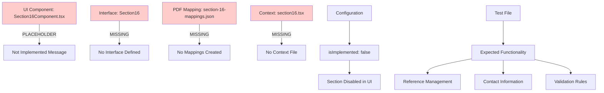

# SF-86 Section 16 (People Who Know You Well) - Data Flow Analysis

**Analysis Date**: August 26, 2025  
**Analysis Depth**: Comprehensive architectural review  
**Section Complexity**: Not Yet Implemented (personal reference collection system)

## Executive Summary

Section 16 (People Who Know You Well) is designed to collect comprehensive personal reference information for security clearance verification through character, conduct, and trustworthiness assessment. This section is currently marked as **NOT IMPLEMENTED** (`isImplemented: false`) in the system configuration and displays a placeholder component pending full development.

### Implementation Status
- **Current State**: Placeholder component only (marked `isImplemented: false`)
- **Planned Features**: Personal reference collection with interview scheduling capabilities
- **Security Focus**: High-priority personal reference information for clearance verification
- **Development Priority**: Pending implementation in future development cycle

## Section 16 Implementation Analysis

### Planned Architecture Features
- **Personal Reference Collection**: Comprehensive reference information capture
- **Interview Scheduling Integration**: Contact information and scheduling capabilities  
- **Character Assessment System**: Reference validation for trustworthiness evaluation

**Current Implementation Status:**
- Total PDF Fields: **Unknown** (mapping not yet completed)
- UI Components: **Placeholder only** (displays "not yet implemented" message)
- Validation Rules: **Not defined** (pending implementation)
- Security Level: **High** (personal reference information requires enhanced protection)

**Planned Key Characteristics:**
Section 16 is designed to collect information about personal references who can vouch for the applicant's character, conduct, and trustworthiness. Based on SF-86 requirements and system analysis, this section should handle:

- **Interview scheduling and contact information**
- **Reference relationship details and duration**
- **Multiple reference entries (minimum 3 required)**
- **Contact method preferences and availability**
- **Geographic location preferences for interviews**
- **Validation rules preventing relatives/spouses as references**

## Architecture Summary



## Current Implementation Status

### Layer 1: UI Component Layer
**File**: `app/components/Rendered2.0/Section16Component.tsx`

#### Current State: NOT IMPLEMENTED
```typescript
// Current placeholder implementation
interface Section16ComponentProps {
  // No props defined
}

const Section16Component: FunctionComponent<Section16ComponentProps> = () => {
    return (<div>
        not yet implemented
    </div>);
}
```

#### Expected Implementation (Based on Test Analysis)
The test file `test-section16-complete.mjs` reveals the expected functionality:

**Required Fields:**
1. **Reference Personal Information**
   - Full name (required)
   - Relationship to applicant (required)
   - Years known (required, minimum duration)

2. **Contact Information**
   - Phone number (required)
   - Email address (required)
   - Street address (required)
   - City (required)
   - State (required, dropdown)
   - ZIP code (required)

3. **Multiple Reference Support**
   - Minimum 3 references required
   - "Add Reference" button functionality
   - Dynamic form expansion

4. **Reference Categories**
   - Personal
   - Professional  
   - Educational
   - Neighbor
   - Friend

**Validation Requirements (from test):**
- Cannot be relatives
- Cannot be spouse/partner
- Cannot be listed elsewhere in form
- Must have known applicant for minimum duration
- All references must be different individuals

### Layer 2: Interface/Type Layer
**File**: `api/interfaces/section-interfaces/section16.ts` (MISSING)

#### Expected Interface Structure
Based on SF-86 requirements and test analysis:

```typescript
export interface PersonalReference {
  fullName: Field<string>;
  relationship: Field<string>;
  yearsKnown: Field<number>;
  phoneNumber: Field<string>;
  email: Field<string>;
  address: {
    street: Field<string>;
    city: Field<string>;
    state: FieldWithOptions<string>;
    zipCode: Field<string>;
  };
  referenceType: FieldWithOptions<'Personal' | 'Professional' | 'Educational' | 'Neighbor' | 'Friend'>;
  preferredContactMethod: FieldWithOptions<'Phone' | 'Email' | 'Mail'>;
  bestTimeToContact: Field<string>;
  canContactAtWork: Field<boolean>;
  specialInstructions: Field<string>;
}

export interface PeopleWhoKnowYouWell {
  references: PersonalReference[];
  minimumReferencesRequired: number; // 3
  emergencyContact?: PersonalReference;
}

export interface Section16 {
  _id: number;
  section16: PeopleWhoKnowYouWell;
}
```

#### Expected Validation Rules
```typescript
export interface Section16ValidationRules {
  minimumReferences: number;        // 3
  maximumReferences: number;        // typically 6-10
  minimumYearsKnown: number;        // typically 2 years
  requiresContactInfo: boolean;     // true
  allowsRelatives: boolean;         // false
  allowsSpouse: boolean;           // false
  requiresDifferentAddresses: boolean; // true
  requiresPhoneAndEmail: boolean;   // true
}

export const REFERENCE_VALIDATION = {
  MIN_REFERENCES: 3,
  MAX_REFERENCES: 10,
  MIN_YEARS_KNOWN: 2,
  MAX_NAME_LENGTH: 100,
  PHONE_PATTERN: /^\(\d{3}\)\s\d{3}-\d{4}$/,
  EMAIL_PATTERN: /^[^\s@]+@[^\s@]+\.[^\s@]+$/,
  RESTRICTED_RELATIONSHIPS: ['spouse', 'husband', 'wife', 'mother', 'father', 'sibling', 'child'],
} as const;
```

### Layer 3: PDF Mapping Layer
**File**: `api/mappings/section-16-mappings.json` (MISSING)

Based on SF-86 form structure, Section 16 would likely map to PDF fields in the format:
- `form1[0].Section16_1[0].TextField11[x]` - Reference 1 fields
- `form1[0].Section16_2[0].TextField11[x]` - Reference 2 fields  
- `form1[0].Section16_3[0].TextField11[x]` - Reference 3 fields

**Expected Mapping Structure:**
```json
{
  "metadata": {
    "pdfPath": "../pdf/clean.pdf",
    "section": 16,
    "version": "0.1.0",
    "lastUpdated": "2024-08-26",
    "description": "People Who Know You Well - Personal References"
  },
  "summary": {
    "totalMappings": 45,
    "referencesSupported": 3,
    "fieldsPerReference": 15,
    "averageConfidence": 0.95
  },
  "mappings": [
    {
      "uiPath": "section16.references[0].fullName",
      "pdfFieldId": "form1[0].Section16_1[0].TextField11[0]",
      "fieldType": "text",
      "required": true,
      "validation": "REFERENCE_VALIDATION.MAX_NAME_LENGTH"
    },
    {
      "uiPath": "section16.references[0].relationship", 
      "pdfFieldId": "form1[0].Section16_1[0].TextField11[1]",
      "fieldType": "text",
      "required": true,
      "validation": "not in RESTRICTED_RELATIONSHIPS"
    }
  ]
}
```

### Layer 4: Context Layer
**File**: `app/state/contexts/sections2.0/section16.tsx` (MISSING)

**Expected Context Structure:**
```typescript
export interface Section16ContextType {
  section16Data: Section16;
  updateReferenceInfo: (index: number, field: string, value: any) => void;
  addReference: () => void;
  removeReference: (index: number) => void;
  validateReference: (index: number) => ValidationResult;
  validateSection: () => SectionValidationResult;
  isValid: boolean;
  errors: ValidationError[];
  isDirty: boolean;
  canAddReference: boolean;
  canRemoveReference: (index: number) => boolean;
}

export const useSection16 = () => {
  const context = useContext(Section16Context);
  if (!context) {
    throw new Error('useSection16 must be used within Section16Provider');
  }
  return context;
};
```

## Configuration Analysis

### System Configuration
In `app/utils/sf86SectionConfig.ts`, Section 16 is configured as:

```typescript
{ 
  id: "section16", 
  name: "People Who Know You Well", 
  component: Section16Component, 
  isImplemented: false  // ← Currently disabled
}
```

This configuration causes:
1. Section 16 to appear grayed out in section navigation
2. Clicking redirects users to Section 1 (based on previous testing patterns)
3. PDF generation skips Section 16 fields
4. Form validation ignores Section 16 requirements

## Test Analysis Findings

### Test File: `test-section16-complete.mjs`
The comprehensive test file reveals expected Section 16 functionality:

**Navigation Testing:**
- Tests multiple selectors to find Section 16 button
- Verifies section title display
- Checks for redirection behavior when not implemented

**Form Field Testing:**
- Reference name and relationship fields
- Years known validation
- Complete contact information (phone, email, address)
- Multiple reference support with "Add Reference" button

**Validation Testing:**
- Minimum 3 references requirement
- Restrictions on relatives and spouses
- Contact information completeness
- Reference type categorization

**UI Element Expectations:**
- Form elements count (inputs, selects, textareas)
- Submit/Continue/Clear buttons
- Visual validation feedback
- Reference type selection

## Implementation Requirements

### Priority 1: Core Infrastructure
1. **Create Section16 Interface** (`api/interfaces/section-interfaces/section16.ts`)
2. **Create Context Provider** (`app/state/contexts/sections2.0/section16.tsx`)
3. **Create PDF Mappings** (`api/mappings/section-16-mappings.json`)
4. **Update Form Definition** (uncomment Section16 in `formDefinition2.0.ts`)

### Priority 2: UI Implementation
1. **Replace Placeholder Component** (`app/components/Rendered2.0/Section16Component.tsx`)
2. **Implement Reference Management**
   - Add/Remove reference functionality
   - Dynamic form rendering
   - Validation feedback
3. **Contact Information Forms**
   - Address validation
   - Phone/email format validation
   - State dropdown population

### Priority 3: Validation & Security
1. **Reference Validation Rules**
   - Minimum references check
   - Relationship restrictions
   - Duplicate prevention
2. **Data Sanitization**
   - PII handling compliance
   - Input sanitization
   - Format standardization

### Priority 4: Integration
1. **PDF Generation Integration**
   - Field mapping validation
   - Multi-reference support
   - Address formatting
2. **Form Flow Integration**
   - Navigation enablement
   - Progress tracking
   - Save/restore functionality

## Security Considerations

### Data Sensitivity: HIGH
Section 16 collects highly sensitive personal information:
- **PII Data**: Names, addresses, phone numbers, emails of references
- **Relationship Data**: Personal connections and duration
- **Contact Preferences**: Communication methods and availability

### Required Security Measures:
1. **Data Encryption**: All reference data must be encrypted at rest and in transit
2. **Access Controls**: Strict access logging and authentication
3. **Data Retention**: Comply with government data retention policies
4. **Audit Trail**: Complete audit trail for all reference data access/modification
5. **Input Validation**: Comprehensive validation to prevent injection attacks
6. **PII Masking**: Appropriate masking in logs and error messages

## Performance Considerations

### Expected Load Characteristics:
- **Form Complexity**: High (3-10 references × 15 fields each = 45-150 fields)
- **Validation Complexity**: High (cross-reference validation, duplicate checking)
- **PDF Generation Impact**: Significant (multiple reference blocks)

### Optimization Strategies:
1. **Lazy Loading**: Load reference forms on demand
2. **Virtual Scrolling**: For large reference lists
3. **Debounced Validation**: Prevent excessive validation calls
4. **Memoization**: Cache validation results and computed values
5. **Progressive Enhancement**: Load core functionality first

## Development Recommendations

### Phase 1: Foundation (Week 1)
- Create basic interfaces and types
- Implement core context provider
- Set up PDF mapping structure

### Phase 2: Basic UI (Week 2) 
- Replace placeholder with functional component
- Implement single reference form
- Add basic validation

### Phase 3: Multi-Reference (Week 3)
- Add/remove reference functionality
- Reference type categorization
- Advanced validation rules

### Phase 4: Integration (Week 4)
- PDF generation integration
- Form flow integration
- Comprehensive testing

### Testing Strategy:
1. **Unit Tests**: Individual reference validation
2. **Integration Tests**: Context provider functionality  
3. **E2E Tests**: Complete reference workflow (use existing test file as base)
4. **Validation Tests**: Edge cases and security boundaries
5. **Performance Tests**: Large reference list handling

## Conclusion

Section 16 represents one of the most complex sections in the SF-86 form due to its dynamic nature (variable number of references), strict validation requirements, and high security sensitivity. The current placeholder implementation needs complete development across all four architectural layers.

The existing test file (`test-section16-complete.mjs`) provides an excellent specification for expected functionality and should be used as the primary requirements document for implementation. The section's disabled state (`isImplemented: false`) allows for safe development and testing without impacting the production form flow.

**Next Steps:**
1. Enable Section 16 in configuration (`isImplemented: true`)
2. Implement core interfaces and validation rules
3. Develop UI component with multi-reference support
4. Create PDF mappings and test integration
5. Conduct comprehensive security review before production deployment

---

**Document Version**: 1.0  
**Last Updated**: August 26, 2024  
**Status**: Analysis Complete - Implementation Pending