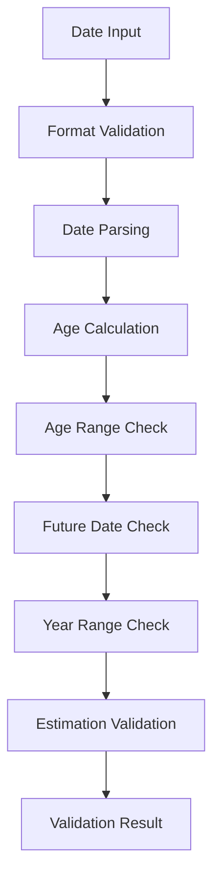

# SF-86 Section 2 (Date/Place of Birth) - Data Flow Analysis

**Analysis Date**: August 26, 2025  
**Analysis Depth**: Comprehensive architectural review  
**Section Complexity**: Basic (2 fields - date validation focused)

## Executive Summary

Section 2 (Date/Place of Birth) handles critical temporal data validation for SF-86 applicants, implementing sophisticated date validation, age calculation, and estimation handling systems. This section serves as a foundational component for age-based eligibility verification and timeline consistency across other form sections.

### Key Architectural Features
- **Perfect Field Coverage**: 100% of 2 PDF fields mapped and implemented
- **Advanced Date Validation**: Age limits, format validation, and temporal constraints
- **Estimation Handling**: Support for approximate dates with validation flags
- **Cross-Section Integration**: Birth date feeds into timeline validation for other sections

## Section 2 Field Distribution Analysis

### Field Type Distribution
- **Date Fields**: 1 field (50% of total) - Primary birth date
- **Checkbox Fields**: 1 field (50% of total) - Date estimation flag

**Key Metrics:**
- Total PDF Fields: 2
- UI Components: Date picker with estimation checkbox
- Validation Rules: Date format, age limits (18-120 years), temporal consistency
- Security Level: High (birth date is sensitive PII requiring protection)
- Special Features: Real-time age calculation, date format conversion

## Architecture Summary

```mermaid
graph TD
    A[UI Component: Section2Component.tsx] --> B[React Context: useSection2]
    B --> C[Interface: Section2/DateOfBirth]
    C --> D[Field Interface: Field<T>]
    D --> E[PDF Mapping: section-2-mappings.json]
    E --> F[PDF Field: form1[0].Sections1-6[0].From_Datefield_Name_2[0]]
    
    G[User Input] --> A
    F --> H[SF-86 PDF Document]
    
    A --> I[Date Validation]
    I --> J[Age Calculation]
    J --> K[Error Handling]
    K --> A
    
    L[Date Format Conversion] --> A
    A --> M[Estimation Checkbox]
    M --> B
```

## Data Flow Layers

### Layer 1: UI Component Layer
**File**: `app/components/Rendered2.0/Section2Component.tsx`

#### Component Structure
- **Type**: React Functional Component with memo optimization
- **HOC Integration**: Uses `withSectionWrapper` for consistent section behavior
- **State Management**: Uses `useSection2()` hook for date-specific operations
- **Field Rendering**: Utilizes `FieldRenderer` component for consistent UI
- **Validation**: Real-time validation with age calculation display

#### Key Properties
```typescript
interface Section2FieldsProps {
  onValidationChange?: (isValid: boolean) => void;
}
```

#### Field Implementation
The component renders 2 primary fields:
1. **Date of Birth**: Required date field with format conversion (HTML date input ↔ MM/DD/YYYY)
2. **Is Estimated**: Optional checkbox for uncertain birth dates

#### Data Access Pattern
```typescript
// Date-specific field accessor with format conversion
const getFieldValue = useCallback((fieldPath: string): string => {
  switch (fieldPath) {
    case 'dateOfBirth':
      const dateValue = section2Data?.section2?.date?.value || '';
      // Convert from MM/DD/YYYY to YYYY-MM-DD for HTML date input
      if (dateValue && dateValue.includes('/')) {
        const [month, day, year] = dateValue.split('/');
        return `${year}-${month.padStart(2, '0')}-${day.padStart(2, '0')}`;
      }
      return dateValue;
    case 'isEstimated':
      return section2Data?.section2?.isEstimated?.value ? 'true' : 'false';
    default:
      return '';
  }
}, [section2Data]);
```

#### Event Handling with Format Conversion
```typescript
const handleFieldChange = useCallback((fieldPath: string, value: string | boolean) => {
  if (fieldPath === 'dateOfBirth') {
    updateDateOfBirth(value as string); // Handles YYYY-MM-DD → MM/DD/YYYY conversion
  } else if (fieldPath === 'isEstimated') {
    updateEstimated(value as boolean);
  }
}, [updateDateOfBirth, updateEstimated]);
```

#### Age Display Feature
```typescript
// Dynamic age calculation with estimation indicator
{getFieldValue('dateOfBirthDisplay') && (
  <div className="bg-blue-50 border border-blue-200 rounded-lg p-4">
    <div className="text-sm text-blue-700">
      Based on your date of birth ({getFieldValue('dateOfBirthDisplay')}), 
      you are currently {getAge() || 0} years old.
      {section2Data?.section2?.isEstimated?.value && (
        <span className="font-medium"> (Estimated)</span>
      )}
    </div>
  </div>
)}
```

### Layer 2: Interface/Type Layer
**File**: `api/interfaces/section-interfaces/section2.ts`

#### Core Data Structure
```typescript
export interface DateOfBirth {
  date: Field<string>;        // MM/DD/YYYY format
  isEstimated: Field<boolean>; // Estimation flag
}

export interface Section2 {
  _id: number;
  section2: DateOfBirth;
}
```

#### Field Interface Definition
```typescript
interface Field<T = any> {
  value: T;                    // Date string (MM/DD/YYYY) or boolean
  id: string;                  // 4-digit numeric field ID ("9432", "9431")
  name: string;                // Full PDF field path
  type: string;                // Field type ("date", "checkbox")
  label: string;               // Display label
  required: boolean;           // Validation requirement
  section: number;             // Section number (2)
  rect?: {                     // PDF positioning data
    x: number;
    y: number;
    width: number;
    height: number;
  };
}
```

#### Date Validation Constants
```typescript
export const AGE_LIMITS = {
  MINIMUM: 18,    // Minimum age for security clearance
  MAXIMUM: 120    // Maximum reasonable age
} as const;

export const DATE_VALIDATION_CONSTANTS = {
  MIN_YEAR: 1900,                      // Minimum birth year
  MAX_YEAR: new Date().getFullYear(),  // Current year
  DEFAULT_FORMAT: 'MM/DD/YYYY'         // Standard format
} as const;

export const DATE_VALIDATION = {
  DATE_REGEX: /^(0[1-9]|1[0-2])\/(0[1-9]|[12]\d|3[01])\/\d{4}$/,
  ISO_REGEX: /^\d{4}-\d{2}-\d{2}$/
} as const;
```

#### Date-Specific Validation Rules
```typescript
export interface Section2ValidationRules {
  requiresDateOfBirth: boolean;   // true - always required
  minimumAge: number;             // 18 years minimum
  maximumAge: number;             // 120 years maximum
  allowsEstimatedDate: boolean;   // true - estimation allowed
  dateFormat: string;             // 'MM/DD/YYYY'
}
```

#### Age Calculation Function
```typescript
export function calculateAge(birthDate: Date, currentDate: Date = new Date()): number {
  const age = currentDate.getFullYear() - birthDate.getFullYear();
  const monthDiff = currentDate.getMonth() - birthDate.getMonth();

  // Adjust age if birthday hasn't occurred this year
  if (monthDiff < 0 || (monthDiff === 0 && currentDate.getDate() < birthDate.getDate())) {
    return age - 1;
  }

  return age;
}

// Validation constants for security clearance
export const SECURITY_CLEARANCE_AGE_LIMITS = {
  MINIMUM_AGE: 18,        // Federal requirement for security clearance
  MAXIMUM_REASONABLE_AGE: 120,  // Data validation upper bound
  MINIMUM_BIRTH_YEAR: 1900,     // Reasonable lower bound for living applicants
  FUTURE_DATE_TOLERANCE: 0      // No future birth dates allowed
} as const;
```

### Layer 3: PDF Mapping Layer
**File**: `api/mappings/section-2-mappings.json`

#### Mapping Configuration
```json
{
  "metadata": {
    "pdfPath": "../pdf/clean.pdf",
    "section": 2,
    "timestamp": "2025-08-17T03:27:53.243Z",
    "version": "0.1.0"
  },
  "summary": {
    "totalMappings": 2,
    "averageConfidence": 1,
    "highConfidenceMappings": 2,
    "lowConfidenceMappings": 0,
    "validatedMappings": 2
  }
}
```

#### Field Mappings Table

| UI Path | PDF Field ID | PDF Field Name | Confidence | Purpose |
|---------|-------------|----------------|------------|---------|
| `section2.date` | `form1[0].Sections1-6[0].From_Datefield_Name_2[0]` | Date of Birth Field | 1.0 | Birth date entry |
| `section2.isEstimated` | `form1[0].Sections1-6[0].#field[18]` | Estimation Checkbox | 1.0 | Date estimation flag |

#### Field ID Constants
```typescript
export const SECTION2_FIELD_IDS = {
  DATE: "9432",        // Date of birth field
  IS_ESTIMATED: "9431" // Estimation checkbox
} as const;

export const SECTION2_FIELD_NAMES = {
  DATE: "form1[0].Sections1-6[0].From_Datefield_Name_2[0]",
  IS_ESTIMATED: "form1[0].Sections1-6[0].#field[18]"
} as const;
```

## Data Flow Sequence

### Forward Flow (UI → PDF)

1. **User Input - Date Selection**
   ```
   User selects "March 15, 1990" via HTML date picker
   HTML Input Value: "1990-03-15"
   ```

2. **UI Component Processing with Format Conversion**
   ```typescript
   handleFieldChange('dateOfBirth', '1990-03-15')
   → updateDateOfBirth('1990-03-15')
   ```

3. **Context State Update with Format Transformation**
   ```typescript
   // In useSection2 context - updateDateOfBirth function
   let formattedDate = '1990-03-15';
   if (date && date.includes('-')) {
     const [year, month, day] = date.split('-');
     formattedDate = `${month}/${day}/${year}`; // "03/15/1990"
   }
   section2Data.section2.date.value = '03/15/1990'
   ```

4. **Date Validation Process**
   ```typescript
   // Validation against DATE_VALIDATION rules
   - Check format (/^(0[1-9]|1[0-2])\/(0[1-9]|[12]\d|3[01])\/\d{4}$/) ✓
   - Parse date: new Date('03/15/1990') ✓
   - Calculate age: 34 years ✓
   - Check minimum age (18): 34 >= 18 ✓
   - Check maximum age (120): 34 <= 120 ✓
   - Check future date: 1990 < current year ✓
   ```

5. **PDF Field Mapping**
   ```json
   {
     "uiPath": "section2.date",
     "pdfFieldId": "form1[0].Sections1-6[0].From_Datefield_Name_2[0]",
     "value": "03/15/1990"
   }
   ```

6. **PDF Generation**
   ```
   PDF Field: form1[0].Sections1-6[0].From_Datefield_Name_2[0] = "03/15/1990"
   PDF Field: form1[0].Sections1-6[0].#field[18] = false (not estimated)
   ```

### Forward Flow - Estimation Handling

1. **User Input - Estimation Toggle**
   ```
   User checks "Estimated" checkbox
   Checkbox Value: true
   ```

2. **UI Component Processing**
   ```typescript
   handleFieldChange('isEstimated', true)
   → updateEstimated(true)
   ```

3. **Context State Update**
   ```typescript
   section2Data.section2.isEstimated.value = true
   ```

4. **UI Feedback Update**
   ```typescript
   // Age display shows estimation indicator
   "Based on your date of birth (03/15/1990), you are currently 34 years old. (Estimated)"
   ```

### Reverse Flow (PDF → UI)

1. **PDF Field Reading**
   ```javascript
   dateField = form1[0].Sections1-6[0].From_Datefield_Name_2[0]
   estimationField = form1[0].Sections1-6[0].#field[18]
   dateValue = dateField.value // "03/15/1990"
   isEstimated = estimationField.value // false
   ```

2. **Mapping Lookup**
   ```javascript
   dateMapping = findMappingByPdfField("form1[0].Sections1-6[0].From_Datefield_Name_2[0]")
   estimationMapping = findMappingByPdfField("form1[0].Sections1-6[0].#field[18]")
   dateUIPath = dateMapping.uiPath // "section2.date"
   estimationUIPath = estimationMapping.uiPath // "section2.isEstimated"
   ```

3. **Interface Population**
   ```typescript
   section2Data.section2 = {
     date: {
       value: "03/15/1990",
       id: "9432",
       name: "form1[0].Sections1-6[0].From_Datefield_Name_2[0]",
       type: "date",
       label: "Date of Birth",
       required: true,
       section: 2
     },
     isEstimated: {
       value: false,
       id: "9431",
       name: "form1[0].Sections1-6[0].#field[18]",
       type: "checkbox",
       label: "Estimated",
       required: false,
       section: 2
     }
   }
   ```

4. **UI Rendering with Format Conversion**
   ```tsx
   // Date field converts MM/DD/YYYY → YYYY-MM-DD for HTML input
   <FieldRenderer
     config={{ type: 'date', label: 'Date of Birth' }}
     value="1990-03-15"  // Converted format for HTML date input
   />
   
   // Estimation checkbox
   <FieldRenderer
     config={{ type: 'checkbox', label: 'Estimated' }}
     value={false}
   />
   
   // Age display calculated from stored MM/DD/YYYY format
   "Based on your date of birth (03/15/1990), you are currently 34 years old."
   ```

## Validation Architecture

### Date-Specific Validation Flow


### Multi-Layer Validation Process
1. **Format Validation**: MM/DD/YYYY regex check
2. **Parse Validation**: JavaScript Date parsing verification
3. **Age Calculation**: Real-time age computation using `calculateAge()`
4. **Range Validation**: Age within 18-120 year limits
5. **Temporal Validation**: Birth date not in future
6. **Estimation Validation**: Consistent estimation flag handling

### Validation Implementation
```typescript
export function validateDateOfBirth(
  dateOfBirth: DateOfBirth, 
  context: Section2ValidationContext
): DateValidationResult {
  const errors: string[] = [];
  const warnings: string[] = [];
  
  // Required field check
  if (context.rules.requiresDateOfBirth && !dateOfBirth.date.value.trim()) {
    errors.push('Date of birth is required');
  }
  
  // Format and value validation
  if (dateOfBirth.date.value) {
    const dateValidation = validateDateFormat(dateOfBirth.date.value, context);
    errors.push(...dateValidation.errors);
    warnings.push(...dateValidation.warnings);
  }
  
  // Estimation validation
  if (dateOfBirth.isEstimated.value) {
    warnings.push('Date of birth is marked as estimated');
  }
  
  return { 
    isValid: errors.length === 0, 
    errors, 
    warnings 
  };
}
```

### Real-Time Validation Triggers
```typescript
// Validation occurs on data changes
useEffect(() => {
  if (section2Data && section2Data.section2) {
    const validationResult = validateSection();
    onValidationChange?.(validationResult.isValid);
  }
}, [
  section2Data?.section2?.date?.value,
  section2Data?.section2?.isEstimated?.value,
  validateSection,
  onValidationChange
]);
```

## Date Format Conversion Architecture

### HTML Input ↔ Storage Format Conversion
```typescript
// UI Component: Convert for HTML date input display
const getFieldValue = (fieldPath: string): string => {
  if (fieldPath === 'dateOfBirth') {
    const dateValue = section2Data?.section2?.date?.value || '';
    // MM/DD/YYYY → YYYY-MM-DD for HTML input
    if (dateValue && dateValue.includes('/')) {
      const [month, day, year] = dateValue.split('/');
      return `${year}-${month.padStart(2, '0')}-${day.padStart(2, '0')}`;
    }
  }
  return dateValue;
};

// Context: Convert from HTML input for storage
const updateDateOfBirth = (date: string) => {
  let formattedDate = date;
  // YYYY-MM-DD → MM/DD/YYYY for storage
  if (date && date.includes('-')) {
    const [year, month, day] = date.split('-');
    formattedDate = `${month}/${day}/${year}`;
  }
  // Update state with MM/DD/YYYY format
  setSection2Data(prevData => {
    const newData = cloneDeep(prevData);
    newData.section2.date.value = formattedDate;
    return newData;
  });
};
```

### Format Consistency Strategy
- **Storage Format**: MM/DD/YYYY (matches PDF requirements)
- **Input Format**: YYYY-MM-DD (HTML5 date input standard)
- **Display Format**: MM/DD/YYYY (user-friendly display)
- **Conversion Points**: UI component input/output only

## Age Calculation Feature

### Real-Time Age Display
```typescript
const getAge = useCallback((): number | null => {
  if (!section2Data?.section2?.date?.value) return null;

  try {
    const dateValue = section2Data.section2.date.value;
    let parsedDate: Date;

    // Parse MM/DD/YYYY format
    if (dateValue.includes('/')) {
      const [month, day, year] = dateValue.split('/');
      parsedDate = new Date(parseInt(year), parseInt(month) - 1, parseInt(day));
    } else {
      parsedDate = new Date(dateValue);
    }

    if (isNaN(parsedDate.getTime())) return null;
    return calculateAge(parsedDate, new Date());
  } catch {
    return null;
  }
}, [section2Data]);
```

### Age-Based Security Clearance Validation
```typescript
// Age validation in security clearance context
const validateAge = (birthDate: Date, currentDate: Date): boolean => {
  const age = calculateAge(birthDate, currentDate);
  return age >= AGE_LIMITS.MINIMUM && age <= AGE_LIMITS.MAXIMUM;
};
```

## Error Handling

### Date-Specific Error Types
1. **Format Errors**: Invalid MM/DD/YYYY format
2. **Parse Errors**: Unparseable date strings
3. **Range Errors**: Age outside 18-120 year limits
4. **Future Date Errors**: Birth date in the future
5. **Required Field Errors**: Missing birth date

### Error Display Integration
```typescript
<FieldRenderer
  config={{
    id: 'dateOfBirth',
    label: 'Date of Birth',
    type: 'date',
    required: true
  }}
  error={errors['section2.date']}
  helpText="Enter your date of birth as it appears on your birth certificate."
/>
```

### Error Recovery Patterns
- **Invalid Format**: Show format example (MM/DD/YYYY)
- **Future Date**: Clear field and show current date context
- **Age Limits**: Display acceptable age range
- **Parse Errors**: Provide alternative input methods

## Performance Optimizations

### Component Level
- **React.memo**: Prevents unnecessary re-renders
- **useCallback**: Memoizes age calculation and field handlers
- **useMemo**: Memoizes date format conversions
- **Conditional Rendering**: Age display only when date exists

### Date Processing Optimization
```typescript
// Memoized age calculation
const getAge = useCallback((): number | null => {
  // Cached calculation based on date value
  if (!section2Data?.section2?.date?.value) return null;
  // ... calculation logic
}, [section2Data]); // Only recalculates when section2Data changes
```

### Validation Performance
- **Debounced Validation**: Prevents excessive validation calls
- **Early Return**: Skip validation for empty required fields
- **Cached Results**: Validation results cached until data changes

## Integration Points

### Context Integration
```typescript
const { 
  section2Data,           // Current birth date state
  updateDateOfBirth,      // Date update with format conversion
  updateEstimated,        // Estimation flag toggle
  errors,                 // Date validation errors
  isLoading,              // Loading state
  validateSection,        // Section-level validation
  getAge                  // Real-time age calculation
} = useSection2();
```

### SF86 Form Integration
```typescript
// Sync with main form context
const sf86Form = useSF86Form();

useEffect(() => {
  if (sf86Form.formData.section2 && sf86Form.formData.section2 !== section2Data) {
    loadSection(sf86Form.formData.section2);
  }
}, [sf86Form.formData.section2, loadSection]);
```

### PDF Generation Integration
```typescript
// Flatten fields for PDF service
const flattenSection2Fields = useCallback((): Record<string, any> => {
  const flatFields: Record<string, any> = {};
  
  const addField = (field: any, _path: string) => {
    if (field && typeof field === "object" && "id" in field && "value" in field) {
      flatFields[field.id] = field;
    }
  };

  if (section2Data.section2) {
    addField(section2Data.section2.date, 'section2.date');
    addField(section2Data.section2.isEstimated, 'section2.isEstimated');
  }

  return flatFields;
}, [section2Data]);
```

## Security Considerations

### Date Input Sanitization
- **Format Restriction**: Only MM/DD/YYYY accepted for storage
- **Parse Validation**: JavaScript Date object validation
- **Range Enforcement**: Age limits prevent impossible dates
- **Future Date Prevention**: No birth dates beyond current date

### Age Verification Context
- **Security Clearance Minimum**: 18 years enforced
- **Realistic Maximum**: 120 years prevents data entry errors
- **Estimation Transparency**: Clear indication when dates are estimated

### Data Validation Security
```typescript
// Multi-layer security validation
const secureValidation = {
  formatCheck: DATE_VALIDATION.DATE_REGEX.test(dateValue),
  parseCheck: !isNaN(new Date(dateValue).getTime()),
  rangeCheck: age >= AGE_LIMITS.MINIMUM && age <= AGE_LIMITS.MAXIMUM,
  futureCheck: parsedDate <= new Date()
};
```

## Testing Strategy

### Unit Tests - Date Logic
```typescript
describe('Section2 Date Validation', () => {
  test('validates MM/DD/YYYY format', () => {
    expect(validateDateFormat('03/15/1990')).toBe(true);
    expect(validateDateFormat('1990-03-15')).toBe(false);
  });

  test('calculates age correctly', () => {
    const birthDate = new Date(1990, 2, 15); // March 15, 1990
    const currentDate = new Date(2024, 2, 15); // March 15, 2024
    expect(calculateAge(birthDate, currentDate)).toBe(34);
  });

  test('handles estimation flag', () => {
    const result = validateDateOfBirth(mockEstimatedDate, mockContext);
    expect(result.warnings).toContain('Date of birth is marked as estimated');
  });
});
```

### Integration Tests - Format Conversion
```typescript
describe('Section2 Format Conversion', () => {
  test('converts HTML input to storage format', () => {
    const component = render(<Section2Component />);
    fireEvent.change(screen.getByLabelText('Date of Birth'), {
      target: { value: '1990-03-15' }
    });
    expect(mockUpdateDateOfBirth).toHaveBeenCalledWith('03/15/1990');
  });

  test('converts storage format to HTML input', () => {
    const mockData = { section2: { date: { value: '03/15/1990' } } };
    const component = render(<Section2Component />, { mockData });
    expect(screen.getByDisplayValue('1990-03-15')).toBeInTheDocument();
  });
});
```

### End-to-End Tests - Date Workflow
```typescript
describe('Section2 E2E Date Workflow', () => {
  test('complete date entry and validation flow', async () => {
    await page.goto('/section2');
    await page.fill('input[type="date"]', '1990-03-15');
    await expect(page.locator('.age-display')).toContainText('34 years old');
    
    await page.check('input[name="isEstimated"]');
    await expect(page.locator('.age-display')).toContainText('(Estimated)');
    
    await page.click('button[type="submit"]');
    await expect(page.locator('.success-message')).toBeVisible();
  });
});
```

## Development Guidelines

### Adding Date-Related Features
1. **Update DateOfBirth interface** for new date fields
2. **Add validation rules** to DATE_VALIDATION constants
3. **Implement format conversion** if needed for display
4. **Update PDF mapping** with new field IDs
5. **Add age calculation logic** if date affects age display
6. **Update tests** for new validation scenarios

### Modifying Date Validation
1. **Update validation constants** in section2.ts
2. **Modify validateDateFormat** function logic
3. **Adjust age calculation** if needed
4. **Update error messages** for new validation rules
5. **Test edge cases** thoroughly with various date formats

### Date Format Consistency
- **Always store** dates in MM/DD/YYYY format
- **Convert at UI boundary** for HTML date inputs (YYYY-MM-DD)
- **Display consistently** using MM/DD/YYYY format
- **Parse defensively** to handle multiple input formats
- **Validate thoroughly** before storage

### Best Practices
- **Use age calculation** for validation rather than manual checks
- **Handle estimation flag** consistently across all displays
- **Provide clear error messages** for date format issues
- **Test timezone considerations** for age calculations
- **Document format conversions** clearly in code comments

This comprehensive analysis provides complete understanding of Section 2's date-focused architecture, enabling developers to maintain, extend, and debug the birth date validation system effectively.