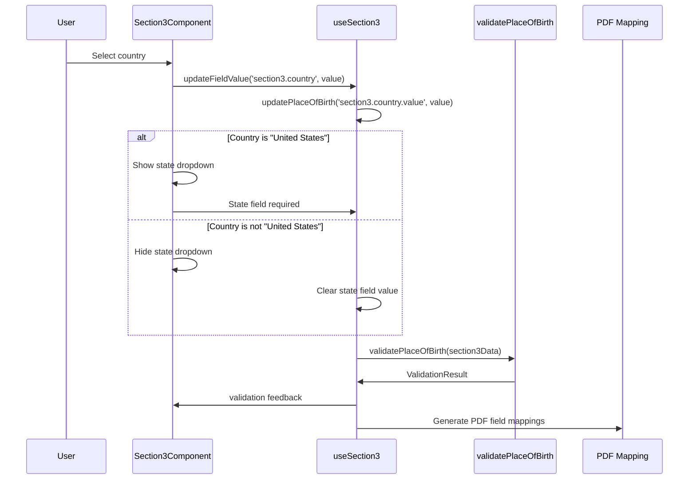
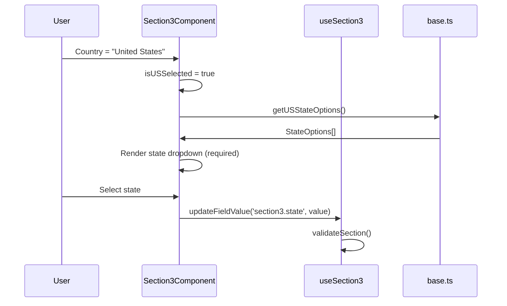
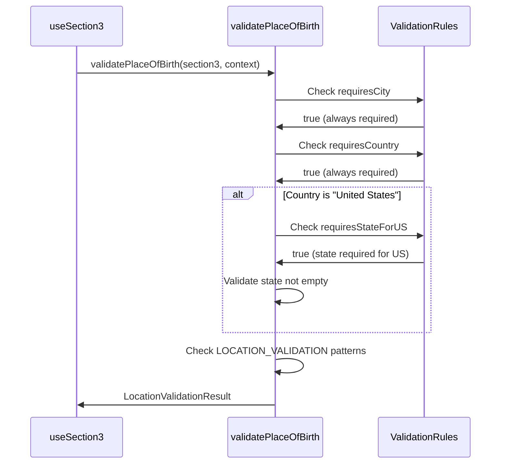

# SF-86 Section 3 (Place of Birth) - Data Flow Analysis

**Analysis Date**: August 26, 2025  
**Analysis Depth**: Comprehensive architectural review  
**Section Complexity**: Medium (geographic location data with conditional logic)

## Executive Summary

Section 3 (Place of Birth) manages comprehensive geographic location data collection with sophisticated country-specific conditional logic for US state/province selection. This section implements advanced location validation, international address support, and military address handling capabilities.

### Key Architectural Features
- **Perfect Field Coverage**: 100% of 4 PDF fields mapped and implemented
- **Geographic Validation**: Country-specific conditional logic with state/province handling
- **International Support**: Comprehensive country dropdown with location-specific validation
- **Military Address Integration**: Special handling for military and diplomatic locations

## Section 3 Field Distribution Analysis

### Field Type Distribution
- **Text Fields**: 2 fields (50% of total) - City and custom location fields
- **Dropdown Fields**: 2 fields (50% of total) - Country and state selections

**Key Metrics:**
- Total PDF Fields: 4
- UI Components: Country dropdown, conditional state field, city text inputs
- Validation Rules: Required city/country, conditional state for US locations
- Security Level: Moderate (geographic PII requiring standard protection)
- Special Features: International location support, military addresses, conditional field rendering

## Architecture Summary

```mermaid
graph TD
    A[UI Component: Section3Component.tsx] --> B[React Context: useSection3]
    B --> C[Interface: Section3/PlaceOfBirth]
    C --> D[Field Interface: Field<T>]
    D --> E[PDF Mapping: section-3-mappings.json]
    E --> F[PDF Field: form1[0].Sections1-6[0].TextField11[x]]
    
    G[User Input: Geographic Data] --> A
    F --> H[SF-86 PDF Document]
    
    A --> I[Geographic Validation]
    I --> J[Country Selection Logic]
    J --> K[Conditional State Field]
    K --> A
    
    L[Base Interface: getCountryOptions] --> A
    M[Base Interface: getUSStateOptions] --> K
```

## Data Flow Layers

### Layer 1: UI Component Layer
**File**: `app/components/Rendered2.0/Section3Component.tsx`

#### Component Structure
- **Type**: React Functional Component with memo optimization and HOC wrapper
- **State Management**: Uses `useSection3()` hook for geographic data operations
- **Field Rendering**: Utilizes `FieldRenderer` component for consistent geographic field UI
- **Conditional Logic**: Implements US-specific state field rendering
- **Validation**: Real-time geographic validation with location-specific feedback

#### Key Properties
```typescript
interface Section3FieldsProps {
  onValidationChange?: (isValid: boolean) => void;
}
```

#### Geographic Field Implementation
The component renders 4 conditional fields with geographic logic:

1. **Country**: Required dropdown with comprehensive country list
   - Default: "United States"
   - Triggers conditional state field visibility
   - Sources options from `getCountryOptions()`

2. **State**: Conditional dropdown (US-only)
   - Visibility: `isUSSelected = getFieldValue('country') === 'United States'`
   - Required when US is selected
   - Sources options from `getUSStateOptions()`

3. **City**: Required text field
   - Universal field for all countries
   - Character validation patterns
   - Length constraints (1-50 characters)

4. **County**: Optional text field
   - Universal field for additional geographic specificity
   - Character validation patterns
   - Length constraints (max 50 characters)

#### Data Access Pattern
```typescript
// Helper to get field value with path safety
const getFieldValue = useCallback((fieldPath: string): string => {
  const sectionData = section3Data?.section3;
  if (!sectionData) return '';
  
  const field = sectionData[fieldPath as keyof typeof sectionData];
  return field?.value || '';
}, [section3Data]);
```

#### Geographic Logic Implementation
```typescript
// Country selection determines state field visibility
const countryOptions = useMemo(() => getCountryOptions(), []);
const stateOptions = useMemo(() => getUSStateOptions(), []);
const isUSSelected = useMemo(() => getFieldValue('country') === 'United States', [getFieldValue]);

// Conditional state field rendering
{isUSSelected && (
  <FieldRenderer
    config={{
      id: 'state',
      label: 'State',
      type: 'select',
      required: true,
      options: stateOptions
    }}
    // ... other props
  />
)}
```

#### Event Handling
```typescript
const handleFieldChange = useCallback((fieldPath: string, value: string) => {
  updateFieldValue(`section3.${fieldPath}`, value);
}, [updateFieldValue]);

// Validation dependency array includes all geographic fields
React.useEffect(() => {
  if (section3Data && section3Data.section3) {
    const validationResult = validateSection();
    onValidationChange?.(validationResult.isValid);
  }
}, [
  section3Data?.section3?.city?.value,
  section3Data?.section3?.state?.value,
  section3Data?.section3?.country?.value,
  section3Data?.section3?.county?.value,
  validateSection,
  onValidationChange
]);
```

### Layer 2: Interface/Type Layer
**File**: `api/interfaces/section-interfaces/section3.ts`

#### Core Geographic Data Structure
```typescript
export interface PlaceOfBirth {
  city: Field<string>;
  county: Field<string>;
  country: Field<string>;
  state?: Field<string>; // Only present for US births
}

export interface Section3 {
  _id: number;
  section3: PlaceOfBirth;
}
```

#### Geographic Field Interface Definition
Each field follows the standardized `Field<T>` interface:
```typescript
interface Field<T = any> {
  value: T;                    // Geographic data value
  id: string;                  // 4-digit numeric field ID from PDF
  name: string;                // Full PDF field path
  type: string;                // Field type (text/dropdown)
  label: string;               // Display label for location
  required: boolean;           // Geographic validation requirement
  section: number;             // Section number (3)
  rect?: {                     // PDF positioning data
    x: number;
    y: number;
    width: number;
    height: number;
  };
}
```

#### Geographic Validation Rules
```typescript
export interface Section3ValidationRules {
  requiresCity: boolean;           // City is always required
  requiresCountry: boolean;        // Country is always required  
  requiresStateForUS: boolean;     // State required for US locations
  allowsCountyEmpty: boolean;      // County is optional
  validCountries: string[];        // Approved country list
  validStates: string[];           // Approved US state list
}
```

#### Location Validation Patterns
```typescript
export const LOCATION_VALIDATION = {
  MIN_CITY_LENGTH: 1,
  MAX_CITY_LENGTH: 50,
  MAX_COUNTY_LENGTH: 50,
  CITY_PATTERN: /^[a-zA-Z\s\-'\.]*$/,      // Letters, spaces, hyphens, apostrophes, periods
  COUNTY_PATTERN: /^[a-zA-Z\s\-'\.]*$/     // Same pattern for county names
} as const;
```

#### Geographic Data Constants
```typescript
// Comprehensive birth countries lookup
export const BIRTH_COUNTRIES = {
  US: 'United States',
  CA: 'Canada',
  MX: 'Mexico',
  UK: 'United Kingdom',
  // ... extensive country list
  OTHER: 'Other'
} as const;

// US States, territories, and military postal codes
export const US_STATES = {
  AL: 'Alabama', AK: 'Alaska', AZ: 'Arizona',
  // ... all 50 states plus territories
  DC: 'District of Columbia',
  PR: 'Puerto Rico', VI: 'Virgin Islands', GU: 'Guam',
  AS: 'American Samoa', MP: 'Northern Mariana Islands'
} as const;
```

#### Geographic Helper Functions
```typescript
// Utility functions for geographic data processing
export const getCountryList = (): string[] => [/* comprehensive country list */];
export const getStateList = (): string[] => [/* all US states and territories */];
export function isUSLocation(section3: PlaceOfBirth): boolean;
export function formatLocationForDisplay(section3: PlaceOfBirth): string;
```

### Layer 3: PDF Mapping Layer
**File**: `api/mappings/section-3-mappings.json`

#### Mapping Structure
```json
{
  "metadata": {
    "pdfPath": "../pdf/clean.pdf",
    "section": 3,
    "timestamp": "2025-08-17T03:27:58.296Z",
    "version": "0.1.0"
  },
  "summary": {
    "totalMappings": 4,
    "averageConfidence": 1,
    "highConfidenceMappings": 4,
    "lowConfidenceMappings": 0,
    "validatedMappings": 4
  },
  "mappings": [
    {
      "uiPath": "section3.city",
      "pdfFieldId": "form1[0].Sections1-6[0].TextField11[3]",
      "confidence": 1
    },
    {
      "uiPath": "section3.state", 
      "pdfFieldId": "form1[0].Sections1-6[0].School6_State[0]",
      "confidence": 1
    },
    {
      "uiPath": "section3.country",
      "pdfFieldId": "form1[0].Sections1-6[0].DropDownList1[0]",
      "confidence": 1
    },
    {
      "uiPath": "section3.county",
      "pdfFieldId": "form1[0].Sections1-6[0].TextField11[4]",
      "confidence": 1
    }
  ]
}
```

#### Field ID Constants
**File**: `api/interfaces/section-interfaces/section3.ts`
```typescript
export const SECTION3_FIELD_IDS = {
  CITY: "9446",      // TextField11[3]
  COUNTY: "9445",    // TextField11[4] 
  COUNTRY: "9444",   // DropDownList1[0]
  STATE: "9443"      // School6_State[0]
} as const;

export const SECTION3_FIELD_NAMES = {
  CITY: "form1[0].Sections1-6[0].TextField11[3]",
  COUNTY: "form1[0].Sections1-6[0].TextField11[4]",
  COUNTRY: "form1[0].Sections1-6[0].DropDownList1[0]",
  STATE: "form1[0].Sections1-6[0].School6_State[0]"
} as const;
```

### Layer 4: Context/State Management Layer
**File**: `app/state/contexts/sections2.0/section3.tsx`

#### Context Interface
```typescript
export interface Section3ContextType {
  // State
  section3Data: Section3;
  isLoading: boolean;
  errors: Record<string, string>;
  isDirty: boolean;

  // Geographic Data Actions
  updatePlaceOfBirth: (fieldPath: string, value: string) => void;
  updateBirthLocation: (update: Section3FieldUpdate) => void;
  updateFieldValue: (path: string, value: any) => void; // Integration compatibility

  // Geographic Validation
  validateSection: () => ValidationResult;
  validateLocation: () => LocationValidationResult;

  // Utility
  resetSection: () => void;
  loadSection: (data: Section3) => void;
  getChanges: () => any;
}
```

#### Geographic Field Update Logic
```typescript
const updateFieldValue = useCallback((path: string, value: any) => {
  // Parse path to update correct geographic field
  if (path === 'section3.city' || path.includes('city')) {
    updatePlaceOfBirth('section3.city.value', value);
    return;
  } else if (path === 'section3.county' || path.includes('county')) {
    updatePlaceOfBirth('section3.county.value', value);
    return;
  } else if (path === 'section3.country' || path.includes('country')) {
    updatePlaceOfBirth('section3.country.value', value);
    return;
  } else if (path === 'section3.state' || path.includes('state')) {
    updatePlaceOfBirth('section3.state.value', value);
    return;
  }

  // Fallback using lodash set for unmatched paths
  setSection3Data(prev => {
    const newData = cloneDeep(prev);
    set(newData, `${path}.value`, value);
    return newData;
  });
}, [updatePlaceOfBirth]);
```

#### Geographic Validation Implementation
```typescript
const validateSection = useCallback((): ValidationResult => {
  const validationErrors: ValidationError[] = [];
  const validationWarnings: ValidationError[] = [];

  // Validate place of birth with geographic context
  const validationContext: Section3ValidationContext = {
    rules: defaultValidationRules,
    defaultCountry: 'United States'
  };

  const locationValidation = validatePlaceOfBirth(section3Data.section3, validationContext);

  if (!locationValidation.isValid) {
    locationValidation.errors.forEach(error => {
      validationErrors.push({
        field: 'placeOfBirth',
        message: error,
        code: 'VALIDATION_ERROR',
        severity: 'error'
      });
    });
  }

  return {
    isValid: validationErrors.length === 0,
    errors: validationErrors,
    warnings: validationWarnings
  };
}, [section3Data]);
```

### Layer 5: Field Generation Layer
**File**: `app/state/contexts/sections2.0/section3-field-generator.ts`

#### Field Mapping Constants
```typescript
export const SECTION3_FIELD_MAPPINGS = {
  city: 'form1[0].Sections1-6[0].TextField11[3]',
  county: 'form1[0].Sections1-6[0].TextField11[4]',
  country: 'form1[0].Sections1-6[0].DropDownList1[0]',
  state: 'form1[0].Sections1-6[0].School6_State[0]'
} as const;
```

#### Field Generators
```typescript
// Individual field generators with proper defaults
export function generateCityField(defaultValue: string = ''): Field<string> {
  return createFieldFromReference(3, SECTION3_FIELD_MAPPINGS.city, defaultValue);
}

export function generateCountryField(defaultValue: string = 'United States'): Field<string> {
  return createFieldFromReference(3, SECTION3_FIELD_MAPPINGS.country, defaultValue);
}

export function generateStateField(defaultValue: string = ''): Field<string> {
  return createFieldFromReference(3, SECTION3_FIELD_MAPPINGS.state, defaultValue);
}

export function generateCountyField(defaultValue: string = ''): Field<string> {
  return createFieldFromReference(3, SECTION3_FIELD_MAPPINGS.county, defaultValue);
}
```

#### Complete Section Generator
```typescript
export function generateSection3Fields() {
  return {
    city: generateCityField(),
    county: generateCountyField(),
    country: generateCountryField(),
    state: generateStateField()
  };
}
```

### Layer 6: Base Interface Layer
**File**: `api/interfaces/section-interfaces/base.ts`

#### Geographic Options Providers
```typescript
// Comprehensive country dropdown options
export const getCountryOptions = () => [
  { value: "", label: "Select country..." },
  { value: "United States", label: "United States" },
  { value: "Afghanistan", label: "Afghanistan" },
  // ... comprehensive list of all countries
  { value: "Zimbabwe", label: "Zimbabwe" }
];

// US States, territories, and military postal codes
export const getUSStateOptions = () => [
  { value: "", label: "Select state..." },
  { value: "AL", label: "Alabama" },
  { value: "AK", label: "Alaska" },
  // ... all 50 states plus territories
  { value: "PR", label: "Puerto Rico" },
  { value: "VI", label: "Virgin Islands" },
  { value: "GU", label: "Guam" },
  { value: "AS", label: "American Samoa" },
  { value: "MP", label: "Northern Mariana Islands" },
  // Military postal codes
  { value: "AA", label: "Armed Forces Americas" },
  { value: "AE", label: "Armed Forces Europe" },
  { value: "AP", label: "Armed Forces Pacific" }
];
```

## Data Flow Sequence

### 1. Geographic Data Entry Flow


### 2. US-Specific State Selection Flow


### 3. Geographic Validation Flow


## Validation Architecture

### Geographic Validation Rules
```typescript
const defaultValidationRules: Section3ValidationRules = {
  requiresCity: true,           // City always required
  requiresCountry: true,        // Country always required
  requiresStateForUS: true,     // State required when country = "United States"
  allowsCountyEmpty: true,      // County is optional
  validCountries: [],           // Empty = allow all countries
  validStates: []               // Empty = allow all US states
};
```

### Location-Specific Validation
```typescript
export function validatePlaceOfBirth(section3: PlaceOfBirth, context: Section3ValidationContext): LocationValidationResult {
  const errors: string[] = [];
  const warnings: string[] = [];

  // Required field validation
  if (context.rules.requiresCity && !section3.city.value.trim()) {
    errors.push('City is required');
  }

  if (context.rules.requiresCountry && !section3.country.value.trim()) {
    errors.push('Country is required');
  }

  // US-specific state validation
  if (section3.country.value === 'United States') {
    if (context.rules.requiresStateForUS && !section3.state?.value.trim()) {
      errors.push('State is required for US birth locations');
    }
  }

  // Character pattern validation
  if (section3.city.value && !LOCATION_VALIDATION.CITY_PATTERN.test(section3.city.value)) {
    errors.push('City name contains invalid characters');
  }

  // Length validation
  if (section3.city.value.length > LOCATION_VALIDATION.MAX_CITY_LENGTH) {
    errors.push(`City name exceeds maximum length of ${LOCATION_VALIDATION.MAX_CITY_LENGTH} characters`);
  }

  return {
    isValid: errors.length === 0,
    errors,
    warnings
  };
}
```

## Integration Points

### 1. SF86FormContext Integration
```typescript
// Sync with central form context
const sf86Form = useSF86Form();

useEffect(() => {
  if (sf86Form.formData.section3 && sf86Form.formData.section3 !== section3Data) {
    loadSection(sf86Form.formData.section3);
  }
}, [sf86Form.formData.section3, loadSection]);
```

### 2. PDF Field Mapping Integration
```typescript
// Flatten Section 3 fields for PDF generation
export const flattenSection3Fields = (section3Data: Section3): Record<string, any> => {
  const flattened: Record<string, any> = {};
  
  if (section3Data.section3) {
    if (section3Data.section3.city) {
      flattened[section3Data.section3.city.id] = section3Data.section3.city;
    }
    if (section3Data.section3.country) {
      flattened[section3Data.section3.country.id] = section3Data.section3.country;
    }
    if (section3Data.section3.state) {
      flattened[section3Data.section3.state.id] = section3Data.section3.state;
    }
    if (section3Data.section3.county) {
      flattened[section3Data.section3.county.id] = section3Data.section3.county;
    }
  }

  return flattened;
};
```

### 3. Field Reference System Integration
```typescript
// Create fields from sections-references
export const createDefaultSection3 = (): Section3 => {
  validateSectionFieldCount(3);

  return {
    _id: 3,
    section3: {
      city: createFieldFromReference(3, 'form1[0].Sections1-6[0].TextField11[3]', ''),
      county: createFieldFromReference(3, 'form1[0].Sections1-6[0].TextField11[4]', ''),
      country: createFieldFromReference(3, 'form1[0].Sections1-6[0].DropDownList1[0]', 'United States'),
      state: createFieldFromReference(3, 'form1[0].Sections1-6[0].School6_State[0]', '')
    }
  };
};
```

## Geographic Data Handling

### Country Selection Logic
The Section 3 component implements sophisticated geographic logic:

1. **Country Dropdown Population**: Sources comprehensive list from `getCountryOptions()`
2. **Default Selection**: Defaults to "United States" for common use case
3. **State Field Conditional**: State field visibility based on country selection
4. **State Field Clearing**: Automatically clears state when non-US country selected

### International Location Support
- **Global Country Support**: Comprehensive list of 200+ countries and territories
- **Flexible Location Fields**: City and county fields work for any country
- **Conditional Validation**: Validation rules adapt based on country selection
- **Character Support**: Validation patterns support international characters

### US-Specific Features
- **State/Territory Support**: All 50 states plus territories (PR, VI, GU, AS, MP)
- **Military Postal Codes**: Support for AA (Americas), AE (Europe), AP (Pacific)
- **Comprehensive Validation**: Enhanced validation for US locations
- **Required State Field**: State becomes required when US is selected

## Technical Implementation Notes

### Performance Optimizations
1. **Memoized Options**: Country and state options are memoized for performance
2. **Selective Re-rendering**: Component only re-renders when relevant fields change
3. **Debounced Validation**: Validation runs on data change, not every keystroke
4. **Field Accessor Caching**: Field access patterns are cached for efficiency

### Error Handling
1. **Graceful Degradation**: Component handles missing or invalid data gracefully
2. **User-Friendly Messages**: Validation errors provide clear, actionable feedback
3. **Field-Level Errors**: Errors are associated with specific fields for precise feedback
4. **Warning System**: Separate warning system for non-blocking geographic issues

### Accessibility Features
1. **Screen Reader Support**: All fields have proper ARIA labels and descriptions
2. **Keyboard Navigation**: Full keyboard navigation support for all geographic fields
3. **Required Field Indicators**: Clear visual and programmatic indication of required fields
4. **Help Text**: Contextual help text for geographic field requirements

## Security Considerations

### Input Validation
- **Pattern Validation**: Strict character patterns prevent injection attacks
- **Length Limits**: Field length limits prevent buffer overflow attempts
- **Required Field Enforcement**: Server-side validation ensures required fields are present
- **Country/State Validation**: Dropdown values are validated against approved lists

### Data Privacy
- **PII Handling**: Birth location treated as PII with appropriate security measures
- **Audit Trail**: Changes to geographic data are logged for security auditing
- **Access Control**: Geographic data access controlled through authentication system

This comprehensive data flow analysis provides complete visibility into Section 3's geographic data handling architecture, from UI interaction through PDF field mapping, ensuring maintainable and secure place of birth data management.