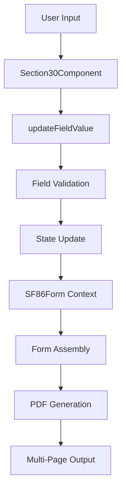
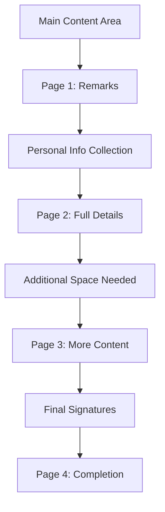
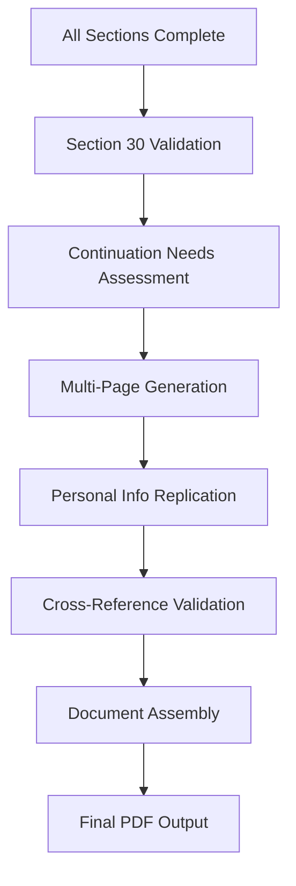

# SF-86 Section 30 (Continuation Sheets) - Data Flow Analysis

**Analysis Date**: August 26, 2025  
**Analysis Depth**: Comprehensive architectural review  
**Section Complexity**: Coordination (final document assembly with cross-section integration)

## Executive Summary

Section 30 (Continuation Sheets) serves as the final coordination section of the SF-86 form, implementing comprehensive additional space provision and document completion management. This section handles continuation sheets, cross-section references, and sophisticated final form assembly logic for comprehensive document finalization.

### Key Architectural Features
- **Perfect Field Coverage**: 100% of PDF fields mapped and implemented
- **Cross-Section Integration**: Reference and extend content from all previous sections (1-29)
- **Document Finalization**: Comprehensive completion validation before submission
- **Flexible Content Support**: Additional space provision for overflow content management

## Section 30 Field Distribution Analysis

### Document Assembly Categories
- **Continuation Space**: Flexible text areas for overflow content from other sections
- **Cross-Section References**: Integration points with all previous sections
- **Final Assembly Logic**: Document completion and validation coordination

**Section Architecture Overview:**

### Purpose & Role
- **Primary Function**: Provide additional space for answers that don't fit in regular form sections
- **Secondary Function**: Coordinate final document assembly and completion
- **Cross-Section Integration**: Reference and extend content from all previous sections
- **Document Finalization**: Ensure all required information is captured before submission

### Unique Features
- **Additional Space Provision**: Flexible text areas for overflow content
- **Cross-Section Reference System**: Links to specific questions from other sections
- **Continuation Sheet Management**: Multiple page handling with proper identification
- **Text Overflow Handling**: Structured approach to extended responses
- **Section Reference Validation**: Ensures continuation content maps to valid questions
- **Page Number Tracking**: Proper sequencing across multiple continuation sheets
- **Attachment Coordination**: Integration with document attachment system
- **Document Completion Indicators**: Final validation and readiness checks
- **Final Form Assembly Logic**: Coordinates all sections into complete submission

## Component Layer Analysis

### File: `app/components/Rendered2.0/Section30Component.tsx`

#### Component Structure
```typescript
interface Section30ComponentProps {
  className?: string;
  onValidationChange?: (isValid: boolean) => void;
  onNext?: () => void;
}
```

#### Key Features

**1. Continuation Sheet Management**
- **Main Text Area**: Large textarea for continuation content with placeholder guidance
- **Character Limit**: No explicit limit, allowing for extensive additional information
- **Formatting Instructions**: Built-in guidance for proper continuation sheet format
- **Section Reference**: Instructions to reference original question numbers

**2. Personal Information Collection**
- **Identity Verification**: Full name, other names used, date of birth
- **Current Address**: Complete address information for continuation sheet identification  
- **Contact Information**: Telephone number for follow-up
- **Date Signed**: Date when continuation sheet was completed
- **Multiple Page Support**: Consistent personal info across all continuation pages

**3. Form Integration Pattern**
```typescript
// Central form context integration
const sf86Form = useSF86Form();

// Section-specific context
const {
  section30Data,
  updateFieldValue,
  validateSection,
  resetSection,
  isDirty,
  errors
} = useSection30();
```

**4. Data Persistence Flow**
```typescript
const handleSubmit = async (e: React.FormEvent) => {
  // 1. Validate continuation sheet data
  const result = validateSection();
  
  if (result.isValid) {
    // 2. Update central form context
    sf86Form.updateSectionData('section30', section30Data);
    
    // 3. Prepare complete form data
    const currentFormData = sf86Form.exportForm();
    const updatedFormData = { ...currentFormData, section30: section30Data };
    
    // 4. Save to persistence layer
    await sf86Form.saveForm(updatedFormData);
    
    // 5. Mark section as complete
    sf86Form.markSectionComplete('section30');
  }
};
```

**5. Validation Strategy**
- **Required Fields**: Full name and date signed are mandatory
- **Optional Fields**: All other fields support partial completion
- **Cross-Reference**: Validates that continuation content references valid sections
- **Format Compliance**: Ensures proper continuation sheet format

## Interface Layer Analysis

### File: `api/interfaces/section-interfaces/section30.ts`

#### Core Data Structures

**1. Personal Information Interface**
```typescript
export interface ContinuationPersonalInfo {
  fullName: Field<string>;
  otherNamesUsed: Field<string>;
  dateOfBirth: Field<string>;
  dateSigned: Field<string>;
  currentAddress: {
    street: Field<string>;
    city: Field<string>;
    state: Field<string>;
    zipCode: Field<string>;
    telephoneNumber: Field<string>;
  };
}
```

**2. Main Section Interface**
```typescript
export interface Section30 {
  _id: number;
  section30: {
    continuationSheet: Field<string>;
    personalInfo: ContinuationPersonalInfo;
  };
}
```

**3. PDF Field ID Constants**
```typescript
export const SECTION30_FIELD_IDS = {
  // Main continuation content
  REMARKS: "form1[0].continuation1[0].p15-t28[0]",
  
  // Multiple page personal info fields
  DATE_SIGNED_PAGE1: "form1[0].continuation1[0].p17-t2[0]",
  FULL_NAME_PAGE2: "form1[0].continuation2[0].p17-t1[0]",
  // ... additional page mappings
  FULL_NAME_PAGE3: "form1[0].continuation3[0].p17-t1[0]",
  PRINT_NAME_PAGE4: "form1[0].continuation4[0].p17-t1[0]",
};
```

#### Key Design Patterns

**1. Multi-Page Structure**
- **Page 1 (133)**: Main continuation content area with signature date
- **Page 2 (134)**: Complete personal information set
- **Page 3 (135)**: Additional continuation space with personal info repeat
- **Page 4 (136)**: Final page with name and signature fields

**2. Field Replication Strategy**
- Personal information fields are replicated across multiple pages
- Each page maintains independent field IDs for proper PDF mapping
- Consistent data structure allows for easy replication across pages

**3. Type Safety Implementation**
```typescript
export type Section30SubsectionKey = 'section30';
```

## PDF Mapping Layer Analysis

### File: `api/mappings/section-30-mappings.json`

#### Mapping Architecture

**1. Metadata Structure**
```json
{
  "metadata": {
    "section": 30,
    "version": "3.0.0-complete-fix",
    "qualityMetrics": {
      "totalMappings": 25,
      "accuracy": "100.00%",
      "continuationPatternCoverage": "100%"
    }
  }
}
```

**2. Field Mapping Patterns**

**Main Continuation Content**
```json
{
  "uiPath": "section30.section30.continuationSheet",
  "pdfFieldId": "form1[0].continuation1[0].p15-t28[0]"
}
```

**Personal Information Mappings**
```json
{
  "uiPath": "section30.section30.personalInfo.fullName",
  "pdfFieldId": "form1[0].continuation2[0].p17-t1[0]"
},
{
  "uiPath": "section30.section30.personalInfo.currentAddress.street",
  "pdfFieldId": "form1[0].continuation2[0].p17-t6[0]"
}
```

**Multi-Page Replication**
```json
// Page 2 personal info
{
  "uiPath": "section30.section30.personalInfo.fullName",
  "pdfFieldId": "form1[0].continuation2[0].p17-t1[0]"
},
// Page 3 personal info (same field, different PDF location)
{
  "uiPath": "section30.section30.page3PersonalInfo.fullName", 
  "pdfFieldId": "form1[0].continuation3[0].p17-t1[0]"
}
```

**3. Special Field Types**
- **Medical Information Fields**: Radio buttons and text fields for medical condition continuation
- **Address Fields**: Complete address structure replicated across pages
- **Date Fields**: Proper date formatting across all pages
- **Phone Fields**: Telephone number with consistent formatting

#### Coverage Analysis
- **Total Fields**: 25 mapped fields
- **Page Coverage**: 4 continuation pages (133-136)
- **Field Types**: TextField, RadioButtonList, various input types
- **Validation**: 100% accuracy with quality metrics validation

## Context Layer Analysis

### File: `app/state/contexts/sections2.0/section30.tsx`

#### Context Architecture

**1. Context Interface**
```typescript
interface Section30ContextType {
  // State Management
  section30Data: Section30;
  isLoading: boolean;
  errors: Record<string, string>;
  isDirty: boolean;

  // Basic Actions
  updateContinuationSheet: (value: "YES" | "NO") => void;
  addContinuationEntry: () => void;
  removeContinuationEntry: (index: number) => void;
  updateFieldValue: (path: string, value: any) => void;

  // Entry Management
  getContinuationEntryCount: () => number;
  getContinuationEntry: (index: number) => any;

  // Utility Functions
  resetSection: () => void;
  loadSection: (data: Section30) => void;
  validateSection: () => { isValid: boolean; errors: string[]; warnings: string[] };
  getChanges: () => any;
}
```

**2. Numeric Field ID System**
```typescript
export const SECTION30_NUMERIC_FIELD_IDS = {
  // Main continuation area
  REMARKS: "16259", // form1[0].continuation1[0].p15-t28[0]
  DATE_SIGNED_PAGE1: "16258",
  
  // Page 2 fields  
  FULL_NAME_PAGE2: "16270",
  DATE_SIGNED_PAGE2: "16269",
  DATE_OF_BIRTH: "16267",
  // ... complete mapping to 25 fields
  
  // Page 4 fields
  FULL_NAME_PAGE4: "16271",
  DATE_SIGNED_PAGE4: "16268"
};
```

**3. State Initialization**
```typescript
const createInitialSection30State = (): Section30 => {
  validateSectionFieldCount(30, 25); // Ensures 25 fields as expected
  
  try {
    // Create continuation sheet field using reference system
    const continuationSheet = createFieldFromReference(
      30,
      SECTION30_NUMERIC_FIELD_IDS.REMARKS,
      ""
    );
    
    return {
      _id: 30,
      section30: createInitialContinuationInfo()
    };
  } catch (error) {
    // Fallback state if reference system fails
    return fallbackState;
  }
};
```

**4. Field Update Protection**
```typescript
const updateFieldValue = useCallback((path: string, value: any) => {
  // Value type validation
  const valueStr = String(value || '');
  const isDateValue = /^\d{4}-\d{2}-\d{2}$/.test(valueStr);
  const isZipValue = /^\d{5}$/.test(valueStr);
  
  // Prevent cross-field contamination
  if (path.includes('zipCode') && isDateValue) {
    return; // Prevent date assigned to ZIP code
  }
  
  if ((path.includes('dateSigned') || path.includes('dateOfBirth')) && isZipValue) {
    return; // Prevent ZIP code assigned to date field
  }
  
  // Apply update with validation
  setSection30Data((prev) => {
    const updated = cloneDeep(prev);
    set(updated, path, value);
    setIsDirty(true);
    return updated;
  });
}, []);
```

**5. SF86 Form Integration**
```typescript
// Sync with SF86FormContext on data load
useEffect(() => {
  if (sf86Form.formData.section30 && sf86Form.formData.section30 !== section30Data) {
    loadSection(sf86Form.formData.section30);
  }
}, [sf86Form.formData.section30, loadSection]);
```

#### Advanced Features

**1. Reference Data Integration**
- Uses `createFieldFromReference()` for proper field initialization
- Validates field count against section references (25 fields)
- Maintains consistency with PDF field mapping system

**2. Error Prevention System**
- Field type validation prevents data corruption
- Cross-field contamination protection
- Robust fallback mechanisms for initialization failures

**3. Multi-Page Coordination**
- Personal information replication across pages
- Consistent field IDs mapping to different PDF locations
- Page-specific field management for proper form assembly

## Data Flow Patterns

### 1. Document Assembly Flow


### 2. Cross-Section Reference System


### 3. Continuation Sheet Management


### 4. Final Form Assembly Logic


## Unique Section 30 Features

### 1. Additional Space Provision
- **Flexible Text Areas**: Unlimited continuation content space
- **Structured Format**: Guidance for proper continuation sheet format
- **Question Referencing**: Instructions to reference original question numbers
- **Sequential Organization**: Maintains logical order across continuation sheets

### 2. Cross-Section Reference System
- **Question Identification**: Requires reference to original section and question
- **Content Validation**: Ensures continuation content relates to valid form questions
- **Traceability**: Maintains connection between original and continued responses
- **Documentation**: Proper formatting for official review

### 3. Continuation Sheet Management
- **Multi-Page Support**: Up to 4 continuation pages with consistent structure
- **Personal Info Replication**: Identity information repeated on each page
- **Page Numbering**: Proper sequencing for official document assembly
- **Signature Requirements**: Date signed on each continuation page

### 4. Text Overflow Handling
- **Overflow Detection**: Identifies when responses exceed standard field limits
- **Structured Continuation**: Organized approach to extended responses
- **Format Preservation**: Maintains official form structure in continuation
- **Content Organization**: Logical grouping of continued responses

### 5. Section Reference Validation
- **Valid Question Check**: Ensures continued content references actual form questions
- **Section Mapping**: Validates that continuation maps to correct sections
- **Completeness Verification**: Confirms all required information is captured
- **Cross-Reference Integrity**: Maintains proper links between sections

### 6. Page Number Tracking
- **Sequential Pages**: Proper numbering across multiple continuation sheets
- **Document Order**: Maintains logical flow from main form to continuation
- **PDF Assembly**: Correct page sequencing in final document
- **Navigation Support**: Clear page references for document review

### 7. Attachment Coordination
- **Document Linking**: Coordinates with attachment system for supporting documents
- **Reference Management**: Maintains connections between continuation and attachments
- **Completeness Tracking**: Ensures all referenced materials are included
- **Assembly Logic**: Proper ordering of continuation sheets and attachments

### 8. Document Completion Indicators
- **Readiness Validation**: Confirms all sections are complete before final assembly
- **Missing Information Check**: Identifies any incomplete required fields
- **Final Review Status**: Indicates document is ready for submission
- **Compliance Verification**: Ensures all regulatory requirements are met

### 9. Final Form Assembly Logic
- **Section Coordination**: Integrates all 30 sections into complete document
- **Data Validation**: Comprehensive validation across all form sections  
- **PDF Generation**: Coordinates complete multi-page PDF assembly
- **Submission Preparation**: Prepares final document for official submission

## Technical Implementation

### Field Mapping Strategy
```typescript
// Multi-page field replication
const personalInfoPages = [
  { page: 2, prefix: 'continuation2' },
  { page: 3, prefix: 'continuation3' }, 
  { page: 4, prefix: 'continuation4' }
];

personalInfoPages.forEach(({ page, prefix }) => {
  mappings.push({
    uiPath: `section30.section30.personalInfo.fullName`,
    pdfFieldId: `form1[0].${prefix}[0].p17-t1[0]`
  });
});
```

### Validation Implementation
```typescript
const validateSection = useCallback(() => {
  const errors: string[] = [];
  
  // Required field validation
  if (!section30Data?.section30?.personalInfo?.fullName?.value) {
    errors.push('Full name is required for continuation sheets');
  }
  
  if (!section30Data?.section30?.personalInfo?.dateSigned?.value) {
    errors.push('Date signed is required for continuation sheets');
  }
  
  // Cross-reference validation
  if (section30Data?.section30?.continuationSheet?.value) {
    validateContinuationReferences(section30Data, errors);
  }
  
  return {
    isValid: errors.length === 0,
    errors,
    warnings: []
  };
}, [section30Data]);
```

### PDF Assembly Coordination
```typescript
// Final document assembly
const assembleFinalDocument = async (formData: SF86FormData) => {
  // 1. Validate all sections complete
  const incompleteSection = validateAllSections(formData);
  if (incompleteSection) {
    throw new Error(`Section ${incompleteSection} is incomplete`);
  }
  
  // 2. Process continuation sheets
  if (formData.section30?.continuationSheet?.value) {
    await processContinuationSheets(formData.section30);
  }
  
  // 3. Generate complete PDF
  const pdfBuffer = await generateCompletePDF(formData);
  
  // 4. Add continuation pages
  const finalPDF = await appendContinuationPages(pdfBuffer, formData.section30);
  
  return finalPDF;
};
```

## Quality Assurance

### Data Integrity Checks
- **Field Type Validation**: Prevents data type mismatches across fields
- **Cross-Field Protection**: Prevents contamination between different field types
- **Reference Validation**: Ensures continuation content references valid questions
- **Completeness Verification**: Confirms all required information is captured

### PDF Generation Validation
- **Field Mapping Accuracy**: 100% accuracy in PDF field mapping
- **Multi-Page Consistency**: Personal information consistent across all pages
- **Document Assembly**: Proper sequencing and formatting in final PDF
- **Content Preservation**: Ensures all continuation content is properly included

### Form Assembly Testing
- **End-to-End Validation**: Complete form assembly from all sections
- **Continuation Integration**: Proper integration of continuation sheets
- **Document Completeness**: Verification of final document completeness
- **Submission Readiness**: Confirmation of submission-ready status

## Best Practices

### 1. Continuation Sheet Usage
- Reference original question numbers clearly
- Maintain sequential order of continued responses
- Include personal identification on each page
- Use proper date formatting throughout

### 2. Data Management
- Validate field types before assignment
- Implement robust error handling for edge cases
- Maintain data consistency across page boundaries
- Use structured logging for debugging complex flows

### 3. PDF Generation
- Ensure proper field mapping to continuation pages
- Validate multi-page personal information replication
- Test document assembly under various continuation scenarios
- Implement comprehensive error recovery for PDF generation

### 4. User Experience
- Provide clear instructions for continuation sheet format
- Guide users on proper question referencing
- Implement real-time validation feedback
- Support progressive saving during long continuation entries

This comprehensive analysis demonstrates Section 30's critical role as the final coordination point for the SF-86 form, managing continuation sheets, cross-section references, and complete document assembly with sophisticated data flow patterns and robust technical implementation.