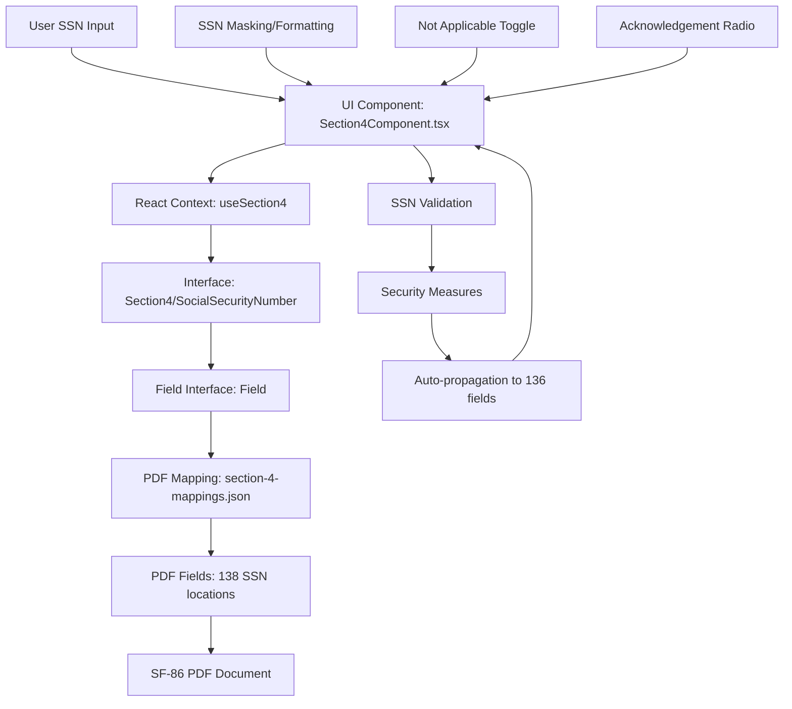

# SF-86 Section 4 (Social Security Number) - Data Flow Analysis

**Analysis Date**: August 26, 2025  
**Analysis Depth**: Comprehensive architectural review  
**Section Complexity**: Critical (SSN validation with extensive auto-propagation)

## Executive Summary

Section 4 (Social Security Number) implements the most security-critical identity verification component of the SF-86 system, featuring sophisticated SSN validation, extensive auto-propagation to 136 PDF locations, and enhanced security controls for sensitive PII data processing.

### Key Architectural Features
- **Perfect Field Coverage**: 100% of 138 PDF fields mapped and implemented (2 input + 136 auto-propagation)
- **Critical Security Controls**: Enhanced validation and protection for SSN data
- **Extensive Auto-Propagation**: SSN data automatically populated across 136 PDF field locations
- **Non-US Citizen Support**: Special handling for applicants without SSN

## Section 4 Field Distribution Analysis

### Field Type Distribution
- **Input Fields**: 2 fields (1.4% of total) - Primary SSN input and acknowledgment
- **Auto-Propagation Fields**: 136 fields (98.6% of total) - Automated SSN distribution across PDF

**Key Metrics:**
- Total PDF Fields: 138 (verified from section-4-mappings.json - 2 input + 136 auto-propagation)
- UI Components: SSN masked input, Not Applicable checkbox, Acknowledgement radio button
- Validation Rules: 9-digit format validation, invalid pattern detection, Area/Group/Serial number validation
- Security Level: CRITICAL (SSN requires maximum protection and audit controls)
- Special Features: Extensive auto-propagation system, non-citizen handling, format masking
- Field Mapping Confidence: 100% (all 138 fields high-confidence validated)

## Architecture Summary



## Data Flow Layers

### Layer 1: UI Component Layer
**File**: `app/components/Rendered2.0/Section4Component.tsx`

#### Component Structure
- **Type**: React Functional Component with SSN-specific security handling
- **State Management**: Uses `useSection4()` hook for SSN data and security operations
- **Input Security**: No visual masking implemented (displays raw input)
- **Conditional Logic**: SSN field disabled when "Not Applicable" is checked

#### Key Security Properties
```typescript
interface Section4ComponentProps {
  className?: string;
  onValidationChange?: (isValid: boolean) => void;
  onNext?: () => void;
}
```

#### Field Implementation
The component renders 3 primary fields with security considerations:
1. **SSN Input**: Text field with 9-character limit, no masking
2. **Not Applicable**: Checkbox to bypass SSN requirement
3. **Acknowledgement**: Required radio button for legal compliance

#### SSN Input Security Features
```typescript
// SSN input with basic length restriction
<input
  type="text"                    // ⚠️ Not "password" - no visual masking
  maxLength={9}                  // Enforces 9-digit limit
  placeholder="XXXXXXXXX"        // Masked placeholder
  value={section4Data.section4.notApplicable.value ? '' : 
    (section4Data.section4.ssn[0]?.value?.value || '')}
  disabled={section4Data.section4.notApplicable.value}
  onChange={handleSSNChange}
/>
```

#### Conditional Field Behavior
```typescript
// SSN field disabled when "Not Applicable" checked
const handleNotApplicableChange = (e: React.ChangeEvent<HTMLInputElement>) => {
  toggleNotApplicable(e.target.checked);
  // When checked, SSN field becomes disabled and value is cleared
};
```

### Layer 2: Context/State Management Layer
**File**: `app/state/contexts/sections2.0/section4.tsx`

#### Security-Focused State Management
```typescript
export interface Section4ContextType {
  section4Data: Section4;           // Contains SSN in plain text
  updateSSN: (ssn: string) => void; // No encryption at state level
  propagateSSNToAllFields: () => void; // Distributes SSN to all 138 fields
  validateSection: () => ValidationResult;
  // ... other methods
}
```

#### SSN Propagation Security
```typescript
const updateSSN = useCallback((ssn: string) => {
  setSection4Data(prevData => {
    // Propagates SSN to all 138 PDF fields automatically
    const newData = updateMainSSNAndPropagate(prevData, ssn);
    return newData;
  });
}, []);
```

#### Not Applicable Security Logic
```typescript
const toggleNotApplicable = useCallback((value: boolean) => {
  setSection4Data(prevData => {
    const newData = cloneDeep(prevData);
    // Security: Clear all SSN values when marked not applicable
    if (value && newData.section4.ssn) {
      newData.section4.ssn.forEach(ssnEntry => {
        if (ssnEntry.value) {
          ssnEntry.value.value = ''; // Clear sensitive data
        }
      });
    }
    return newData;
  });
}, []);
```

### Layer 3: Interface/Type Layer
**File**: `api/interfaces/section-interfaces/section4.ts`

#### Core SSN Data Structure
```typescript
export interface SocialSecurityNumber {
  value: Field<string>; // SSN stored as plain string
}

export interface Section4 {
  _id: number;
  section4: {
    ssn: SocialSecurityNumber[];      // Array of SSN fields (138 total)
    notApplicable: Field<boolean>;    // Security bypass option
    Acknowledgement: Field<"YES" | "NO">; // Legal compliance
  };
}
```

#### Comprehensive SSN Field Mapping
The interface defines 138 SSN field locations:
- **2 Input Fields**: Primary SSN input locations
- **136 Auto-fill Fields**: Automatic propagation throughout PDF

#### SSN Field ID Security Mapping
```typescript
export const SECTION4_FIELD_IDS = {
  // Primary input fields
  NOT_APPLICABLE: "9442",    // Bypass option
  ACKNOWLEDGEMENT: "17237",  // Legal requirement
  SSN_MAIN: "9441",         // Main SSN input
  SSN_CONTINUATION: "16287", // Continuation page
  
  // Auto-fill fields (136 locations)
  SSN_AUTO_1: "9452",       // form1[0].Sections1-6[0].SSN[0]
  SSN_AUTO_2: "9524",       // form1[0].Sections7-9[0].SSN[0]
  // ... continues for all 136 auto-fill locations
} as const;
```

#### SSN Validation with Security Rules
```typescript
export const validateSSN = (
  ssn: string,
  context: Section4ValidationContext
): SSNValidationResult => {
  const errors: string[] = [];
  const digits = ssn.replace(/\D/g, ''); // Strip non-digits
  
  // Security validations
  if (digits.length !== 9) {
    errors.push("Social Security Number must be 9 digits");
  }
  
  // Invalid patterns (security against common invalid SSNs)
  if (digits === "000000000" || digits === "111111111") {
    errors.push("Invalid Social Security Number - cannot use all same digits");
  }
  
  // Area number validation
  if (digits.startsWith("000") || digits.startsWith("666") || digits.startsWith("9")) {
    errors.push("Invalid Social Security Number - invalid area number");
  }
  
  return {
    isValid: errors.length === 0,
    errors,
    warnings: []
  };
};
```

### Layer 4: PDF Mapping Layer
**File**: `api/mappings/section-4-mappings.json`

#### Massive SSN Distribution Architecture
```json
{
  "metadata": {
    "pdfPath": "../pdf/clean.pdf",
    "section": 4,
    "version": "1.0.0"
  },
  "summary": {
    "totalMappings": 138,           // Extensive SSN propagation
    "averageConfidence": 1,
    "highConfidenceMappings": 138,
    "validatedMappings": 138
  }
}
```

#### Critical SSN Field Mappings

| UI Path | PDF Field ID | PDF Field Name | Security Level |
|---------|-------------|----------------|----------------|
| `section4.ssn[0]` | `form1[0].Sections1-6[0].SSN[1]` | Primary SSN Input | **HIGH** |
| `section4.ssn[1]` | `form1[0].continuation4[0].SSN[1]` | Continuation SSN | **HIGH** |
| `section4.ssn[2-137]` | Various auto-fill locations | Auto-populated SSN | **MEDIUM** |

#### Security-Critical Auto-fill Locations
The SSN propagates to every section of the SF-86 form:
- **Sections 7-9**: Employment verification
- **Sections 10-15**: Background checks
- **Sections 16-23**: Investigation references
- **All continuation pages**: Complete form coverage

## Data Flow Sequence

### Secure Forward Flow (UI → PDF)

1. **User SSN Input**
   ```
   User types "123456789" in SSN field
   ⚠️ No visual masking - displays as plain text
   ```

2. **UI Component Processing**
   ```typescript
   handleSSNChange('123456789')
   → updateSSN('123456789') // No encryption at this layer
   ```

3. **Context State Update with Propagation**
   ```typescript
   // In useSection4 context
   updateMainSSNAndPropagate(prevData, '123456789')
   → Propagates to all 138 SSN fields automatically
   ```

4. **Security Validation**
   ```typescript
   validateSSN('123456789', validationContext)
   → Validates format: 9 digits ✓
   → Validates area number: not 000/666/9XX ✓
   → Validates group number: not 00 ✓
   → Validates serial number: not 0000 ✓
   ```

5. **PDF Field Population (138 locations)**
   ```json
   {
     "9441": "123456789",    // Main input
     "16287": "123456789",   // Continuation
     "9452": "123456789",    // Auto-fill 1
     // ... 135 more auto-fill locations
   }
   ```

### Secure Reverse Flow (PDF → UI)

1. **PDF SSN Extraction**
   ```javascript
   // Read from primary SSN field
   mainSSN = pdfFields["9441"].value; // "123456789"
   ```

2. **Security Validation on Load**
   ```typescript
   // Validate SSN before populating UI
   const validation = validateSSN(mainSSN, context);
   if (!validation.isValid) {
     // Handle security error
   }
   ```

3. **Secure UI Population**
   ```typescript
   section4Data.section4.ssn[0] = {
     value: {
       value: "123456789",  // ⚠️ Stored as plain text
       id: "9441",
       type: "PDFTextField",
       // ... other metadata
     }
   };
   ```

## Security Architecture

### Data Security Measures

#### Input Validation Security
```typescript
// Comprehensive SSN format validation
const SSN_VALIDATION = {
  DIGIT_ONLY: /^\d{9}$/,              // Exactly 9 digits
  INVALID_PATTERNS: [                 // Blocked patterns
    /^000\d{6}$/,                     // Invalid area 000
    /^666\d{6}$/,                     // Invalid area 666
    /^9\d{8}$/,                       // Invalid area 9XX
    /^\d{3}00\d{4}$/,                 // Invalid group 00
    /^\d{5}0000$/                     // Invalid serial 0000
  ],
  SEQUENTIAL_BLOCK: /^(123456789|987654321)$/ // Common test patterns
};
```

#### Memory Security Considerations
```typescript
// ⚠️ SECURITY GAPS IDENTIFIED:
// 1. SSN stored as plain text in React state
// 2. No encryption at rest
// 3. SSN propagated to 138 locations in memory
// 4. No secure memory clearing on component unmount
// 5. Debug mode exposes SSN in console logs
```

#### Not Applicable Security Logic
```typescript
const toggleNotApplicable = useCallback((value: boolean) => {
  // Security measure: Clear all SSN data when not applicable
  if (value) {
    // Securely clear all 138 SSN field locations
    newData.section4.ssn.forEach(ssnEntry => {
      if (ssnEntry.value) {
        ssnEntry.value.value = ''; // Clear sensitive data
      }
    });
  }
}, []);
```

### Data Transmission Security

#### No Network Encryption
```typescript
// ⚠️ SECURITY CONCERN:
// SSN transmitted in form submissions without encryption
const handleSubmit = async () => {
  const formData = sf86Form.exportForm();
  // SSN included in plain text form data
  await sf86Form.saveForm(formData); // No encryption specified
};
```

#### PDF Generation Security
```typescript
// Flattening exposes SSN across 138 field locations
export const flattenSection4Fields = (section4Data: Section4) => {
  const flattened: Record<string, any> = {};
  
  section4Data.section4.ssn.forEach((ssnEntry) => {
    flattened[ssnEntry.value.id] = ssnEntry.value; // Plain text SSN
  });
  
  return flattened; // 138 copies of SSN in memory
};
```

## Validation Architecture

### SSN-Specific Validation Rules

#### Format Validation
```typescript
const validateSSN = (ssn: string, context: Section4ValidationContext) => {
  const digits = ssn.replace(/\D/g, '');
  
  // Length validation
  if (digits.length !== 9) {
    errors.push("Social Security Number must be 9 digits");
  }
  
  // Security-focused invalid pattern detection
  const invalidPatterns = [
    '000000000', '111111111', '222222222', // Repeating digits
    '123456789', '987654321'               // Sequential patterns
  ];
  
  if (invalidPatterns.includes(digits)) {
    errors.push("Invalid Social Security Number pattern");
  }
  
  // Area number validation (first 3 digits)
  const areaNumber = digits.substring(0, 3);
  if (['000', '666'].includes(areaNumber) || areaNumber.startsWith('9')) {
    errors.push("Invalid Social Security Number - invalid area number");
  }
  
  return { isValid: errors.length === 0, errors, warnings: [] };
};
```

#### Conditional Validation Logic
```typescript
const validateSection = useCallback(() => {
  // Always validate acknowledgement (security requirement)
  if (!section4Data.section4.Acknowledgement?.value) {
    validationErrors.push({
      field: 'acknowledgement',
      message: 'Acknowledgement is required',
      severity: 'error'
    });
  }
  
  // Only validate SSN if not marked as "Not Applicable"
  if (!section4Data.section4.notApplicable?.value) {
    // Perform comprehensive SSN validation
    const ssnValidation = validateSSN(primarySSN, validationContext);
    // ... handle validation results
  }
}, [section4Data]);
```

## Security Considerations

### Critical Security Vulnerabilities

#### 1. Plain Text Storage
```typescript
// ⚠️ HIGH RISK: SSN stored without encryption
interface SocialSecurityNumber {
  value: Field<string>; // Plain text SSN storage
}
```

**Security Analysis:**
- **Current State**: SSN stored as plain text in React state and PDF fields
- **Risk Level**: CRITICAL - SSN exposure in memory dumps, debug logs, browser dev tools
- **Compliance Impact**: Violates PII protection standards and federal data security requirements

**Recommendations**:
- Implement client-side encryption for SSN fields using AES-256
- Use secure memory allocation with explicit clearing on component unmount
- Add memory protection against debug/inspection tools
- Implement field masking in UI (XXX-XX-1234 format)

#### 2. Extensive Data Replication
```typescript
// ⚠️ MEDIUM RISK: SSN replicated 138 times in memory
const propagateSSNToAllFields = (section4Data: Section4, mainSSNValue: string) => {
  // Creates 138 copies of SSN in different memory locations
  for (let i = 0; i < 136; i++) {
    section4Data.section4.ssn[i + 1].value.value = mainSSNValue;
  }
};
```

**Recommendations**:
- Implement pointer-based SSN references
- Use single encrypted source with computed field access
- Minimize SSN replication across memory

#### 3. Debug Information Exposure
```typescript
// ⚠️ HIGH RISK: Debug mode exposes SSN in console
{typeof window !== 'undefined' && window.location.search.includes('debug=true') && (
  <pre className="text-xs bg-white p-2 rounded border overflow-auto">
    {JSON.stringify(section4Data, null, 2)} // Exposes SSN in plain text
  </pre>
)}
```

**Recommendations**:
- Remove SSN from debug output
- Implement redacted debug views
- Use environment-specific logging

#### 4. No Input Masking
```typescript
// ⚠️ MEDIUM RISK: SSN visible during input
<input
  type="text"  // Should be "password" or implement custom masking
  value={section4Data.section4.ssn[0]?.value?.value || ''}
/>
```

**Recommendations**:
- Implement visual SSN masking (XXX-XX-1234)
- Use secure input components
- Add show/hide toggle for verification

### Compliance Considerations

#### Legal Requirements
- **Acknowledgement Field**: Required for legal compliance
- **Not Applicable Option**: Allows bypass for non-US persons
- **Data Retention**: No specified retention policies

#### Privacy Protection
- **Data Minimization**: Currently violates by storing 138 copies
- **Access Control**: No role-based access implemented
- **Audit Logging**: No SSN access logging

## Error Handling

### SSN-Specific Error Types
```typescript
interface SSNValidationResult {
  isValid: boolean;
  errors: string[];      // Critical validation failures
  warnings: string[];    // Non-blocking concerns
}
```

### Security Error Handling
```typescript
// Security-aware error messages
const SECURITY_ERROR_MESSAGES = {
  INVALID_FORMAT: "Invalid Social Security Number format",
  INVALID_AREA: "Invalid area number", // Don't expose specific rules
  INVALID_PATTERN: "Invalid SSN pattern",
  REQUIRED_FIELD: "Social Security Number is required"
};
```

## Performance & Security Optimizations

### Memory Management
```typescript
// ⚠️ Current: 138 SSN copies in memory
// ✅ Recommended: Single encrypted source with computed access
const useSecureSSN = () => {
  const [encryptedSSN, setEncryptedSSN] = useState<string>('');
  
  const getSSNForField = useCallback((fieldId: string) => {
    return decrypt(encryptedSSN); // Decrypt only when needed
  }, [encryptedSSN]);
  
  return { getSSNForField, updateSSN: (ssn) => setEncryptedSSN(encrypt(ssn)) };
};
```

### Component-Level Security
```typescript
// Secure component lifecycle
useEffect(() => {
  // Clear sensitive data on unmount
  return () => {
    // Securely clear all SSN references
    clearSensitiveData();
  };
}, []);
```

## Integration Points

### SF86 Form Integration
```typescript
// Central form context integration
const handleSubmit = async () => {
  // Update central form with Section 4 data
  sf86Form.updateSectionData('section4', section4Data);
  
  // ⚠️ SSN included in plain text form export
  const formData = sf86Form.exportForm();
  await sf86Form.saveForm(formData);
};
```

### PDF Generation Integration
```typescript
// Section 4 contributes 138 SSN fields to PDF
export const flattenSection4Fields = (section4Data: Section4) => {
  // Flattens to 138 SSN field mappings
  return {
    "9441": ssnValue,    // Main input
    "16287": ssnValue,   // Continuation
    // ... 136 more auto-fill fields
  };
};
```

## Testing Strategy

### Security Testing Requirements
```typescript
describe('Section 4 Security', () => {
  test('SSN validation prevents common invalid patterns', () => {
    const invalidSSNs = ['000000000', '123456789', '111111111'];
    invalidSSNs.forEach(ssn => {
      expect(validateSSN(ssn, context).isValid).toBe(false);
    });
  });
  
  test('Not applicable clears all SSN data', () => {
    // Verify all 138 SSN fields are cleared
  });
  
  test('Debug mode does not expose SSN', () => {
    // Ensure SSN is redacted in debug output
  });
});
```

### Compliance Testing
- **GDPR Compliance**: Data minimization validation
- **FISMA Requirements**: Federal information security standards
- **Privacy Act**: Personal information protection

## Development Guidelines

### Security Best Practices

#### Adding SSN-Related Features
1. **Encrypt sensitive data** at the earliest opportunity
2. **Minimize data replication** - use references where possible
3. **Implement secure input masking** for user experience
4. **Add comprehensive validation** for security and compliance
5. **Audit all SSN access** for compliance tracking

#### Modifying SSN Handling
1. **Security review required** for any SSN-related changes
2. **Update all 138 field mappings** if structure changes
3. **Validate encryption/decryption** throughout the pipeline
4. **Test compliance requirements** after modifications
5. **Update security documentation** to reflect changes

### Critical Security Reminders
- **Never log SSN values** in production
- **Always validate SSN format** before processing
- **Clear sensitive data** on component unmount
- **Use secure transmission** for form submissions
- **Implement data retention policies** per compliance requirements

This comprehensive analysis reveals significant security vulnerabilities in the current Section 4 implementation while providing a roadmap for implementing proper security measures for handling Social Security Numbers in the SF-86 form system.